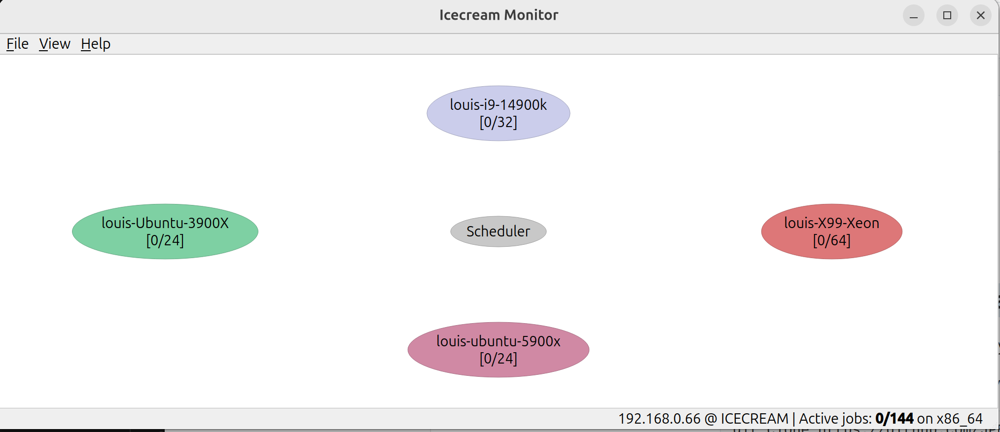

# Icecream Distributed Building Cluster Setup Guide for Ubuntu

This guide will help you set up an Icecream distributed building cluster on Ubuntu. Icecream allows you to distribute compilation tasks across multiple machines, significantly speeding up build times for large projects.

## Prerequisites

- Ubuntu machines (can be physical or virtual)
- Sudo access on all machines
- Network connectivity between all machines


## Building Icecream, Icemon, and Icecream-sundae

Before setting up the Icecream distributed building cluster, you need to build and install Icecream, Icemon, and Icecream-sundae. Follow these steps on each machine in your cluster:

### 1. Building Icecream

1. Install dependencies:

   ```
   sudo apt-get update
   sudo apt-get install -y libcap-dev liblzo2-dev libzstd-dev libarchive-dev
   # WARNING: Make sure you specify a prefix, otherwise icecream
   might override your gcc installation! You will need to use this
   prefix instead of /usr when referring to icecream (for example
   when extending the $PATH variable).
   ```

2. Clone the Icecream repository:

   ##### Using my branch, it revert the commit that breaks icemon
   https://github.com/stefanu21/icecream/commit/053a05e87305a220ba3005dd4d29ae8e17b0d6a7
   https://github.com/icecc/icecream/commit/c0f9d537bd47e3326e1126444267cf43bd59696f

   ```
   git clone https://github.com/icecc/icecream.git
   ```

3. Build and install Icecream:

   ##### WARNING: Make sure you specify a prefix, otherwise icecream might override your gcc installation! You will need to use this prefix instead of /usr when referring to icecream (for example when extending the $PATH variable).

   ```
   cd icecream
   ./autogen.sh
   ./configure --prefix=/opt/icecream
   mkdir build && cd build
   cmake ..
   make
   sudo make install
   ```


	##### 	It'll show some errors regarding generating docs, ignore them, and you still need to copy the executables into 	    `/opt/icecream`

4. Copy executables

   ```bash
   cd icecream
   sudo cp client/icecc /opt/icecream/bin
   sudo cp client/icecc-test-env /opt/icecream/bin
   sudo cp client/icecc-create-env /opt/icecream/bin
   sudo cp scheduler/icecc-scheduler /opt/icecream/sbin
   sudo cp compilerwrapper/compilerwrapper /opt/icecream/bin/compilerwrapper
   ```


### 2. Building Icemon

Icemon is a GUI monitor for Icecream.

1. Install dependencies:
   ```
   sudo apt-get install pkg-config libicecc-dev
   sudo apt-get install build-essential qtbase5-dev cmake extra-cmake-modules
   ```

2. Clone the Icemon repository:
   ```
   git clone https://github.com/icecc/icemon.git
   cd icemon
   ```

3. Build and install Icemon:
   ```bash
   mkdir build && cd build
   cmake -DCMAKE_INSTALL_PREFIX=/usr ..
   make
   sudo make install
   ```

4. Run

   ```bash
   icemon
   ```

   Or

   ```bash
   icemon -n ICECREAM
   ```

5. You'll see its UI

   <p align="center">
     
   </p>


### 3. Building Icecream-sundae(optional, a replacement for icemon)

Icecream-sundae is a Qt-based system tray application for Icecream.

1. Clone the Icecream-sundae repository:
   ```
   sudo apt-get install g++ libcap-ng-dev libglib2.0-dev libicecc-dev liblzo2-dev libncursesw5-dev meson ninja-build
   git clone https://github.com/JPEWdev/icecream-sundae.git
   cd icecream-sundae
   ```

2. Build and install Icecream-sundae:
   ```
   mkdir build && cd build
   meson .. --buildtype release
   ninja
   sudo -E ninja install
   ```

After completing these steps, you will have Icecream, Icemon, and Icecream-sundae installed on your system. You can now proceed with setting up the Icecream distributed building cluster as described in the following sections.

### 4. Setting up Environment

To ensure that the Icecream binaries are accessible from anywhere in your system, you need to add the Icecream directories to your PATH. This can be done by modifying your `~/.bashrc` file.

1. Open your `~/.bashrc` file in a text editor:
   ```
   nano ~/.bashrc
   ```

2. Add the following lines at the end of the file:
   ```
   export PATH="/opt/icecream/bin:$PATH"
   export PATH="/opt/icecream/sbin:$PATH"
   ```

3. Save the file and exit the text editor. If you're using nano, you can do this by pressing `Ctrl+X`, then `Y`, and finally `Enter`.

4. To apply the changes immediately, source your `~/.bashrc` file:
   ```
   source ~/.bashrc
   ```

Now, the Icecream binaries will be accessible from anywhere in your terminal. You can verify this by running:


## 5. Setup

1. Set up the Scheduler (one per cluster)
2. Set up Daemons (on all machines, including the scheduler machine)

### Prerequisites

1. Adding user to icecc group

```
groupadd icecc
useradd -g icecc icecc -s /sbin/nologin
```

#### 1. Setting up the Scheduler

The scheduler coordinates jobs across the cluster. You should only have one scheduler per cluster.

1. Copy the `scheduler.sh` script to your designated scheduler machine.
2. Make the script executable:
   ```
   chmod +x scheduler.sh
   ```
3. Set scheduler host if needed in `scheduler.sh`:

   ```bash
   ICECREAM_SCHEDULER_HOST="<your scheduler host IP address>"
   ```
4. Run the script with sudo:

   ```
   sudo ./scheduler.sh
   ```

This script will:
- Create the necessary configuration file
- Set up the Icecream scheduler as a systemd service
- Enable and start the service

Note: By default, the scheduler is set to listen on IP 192.168.0.66. If your scheduler has a different IP, modify the `ICECREAM_SCHEDULER_HOST` variable in the script before running.

#### 2. Setting up Daemons

Daemons should be set up on all machines in the cluster, including the scheduler machine.

1. Copy the `daemon.sh` script to each machine in your cluster.

2. Make the script executable:
   ```
   chmod +x daemon.sh
   ```

3. Set scheduler host if needed in `daemon.sh`:

   ```bash
   ICECREAM_SCHEDULER_HOST="<your scheduler host IP address>"
   ```

4. Run the script with sudo:

   ```
   sudo ./daemon.sh
   ```

5. Set proper owner for cache directory, optional

   ```bas
   sudo chown -R icecc:icecc /data/iceccd/cache
   sudo systemctl restart iceccd
   ```


This script will:

- Create a cache directory for Icecream
- Set up the necessary configuration
- Set up the Icecream daemon as a systemd service
- Enable and start the service

Note: The daemon script also uses the IP 192.168.0.66 as the scheduler host. If you changed this in the scheduler setup, make sure to update it in the daemon script as well.

#### Using the Icecream Cluster

To use Icecream for your builds:

1. Install the Icecream package on your development machine:
   ```
   sudo apt-get install icecc
   ```

2. Set up your compiler to use Icecream. For example, for GCC:
   ```
   export PATH=/opt/icecream/libexec/icecc/bin:$PATH
   ```

3. Run your build command as normal. Icecream will automatically distribute the compilation tasks across the cluster.

###### Troubleshooting

- If nodes aren't connecting, check firewall settings. Icecream uses port 10245 by default.
- Verify the scheduler IP is correctly set in both scheduler and daemon configurations.
- Check the logs for more detailed error messages:
  - Scheduler log: `/var/log/icecc-scheduler.log`
  - Daemon log: `/tmp/iceccd.log`


## 6. Setting up Chromium build using clang and clang++ with Icecream

There are two ways to set up clang and clang++ to use Icecream:

#### 1.1. Option 1: Using symbolic links

1. Navigate to your Icecream bin directory:
   ```bash
   cd /opt/icecream/bin
   ```

2. Create symbolic links for clang and clang++ to the local icecc:
   ```bash
   sudo ln -s /opt/icecream/bin/icecc clang
   sudo ln -s /opt/icecream/bin/icecc clang++
   ```

3. Verify the symbolic links:
   ```bash
   ls -l /opt/icecream/bin
   ```
   You should see something like this:
   ```
   clang -> /opt/icecream/bin/icecc
   clang++ -> /opt/icecream/bin/icecc
   ```

4. Ensure that `/opt/icecream/bin` is in your PATH:
   ```bash
   export PATH=/opt/icecream/bin:$PATH
   ```

#### 1.2. Option 2: Adding Icecream bin directory to PATH

Alternatively, you can simply add the Icecream bin directory to your PATH:

1. Add the following line to your shell configuration file (e.g., ~/.bashrc or ~/.zshrc):
   ```bash
   export PATH=/opt/icecream/libexec/icecc/bin:$PATH
   ```

2. Reload your shell configuration or open a new terminal session.

With either option, you can now use `clang` and `clang++` as usual, and they should be intercepted by Icecream.

#### 2. Using Icecream with Chromium Build Script

For a more streamlined approach to building Chromium with Icecream, you can use the build script from the [ChromiumBuild repository](https://github.com/icew4y/ChromiumBuild). This script automates the process of setting up and building Chromium with Icecream support.

##### Steps to use the build script:

1. Clone the ChromiumBuild repository:
   ```bash
   git clone https://github.com/icew4y/ChromiumBuild.git
   cd ChromiumBuild
   cp org-buildChromiumICECC.sh ~/path/to/chromium/src
   ```

2. Make the script executable:
   ```bash
   chmod +x org-buildChromiumICECC.sh
   ```

3. Run the script:
   ```bash
   # change the core you want to use
   # time ninja -k <cores> -j <cores> -C out/"$1" chrome ${@:2}
   ./org-buildChromiumICECC.sh.sh Debug/Release
   ```

4. Other options:

   ```bash
   ./org-buildChromiumICECC.sh --help
   ```


Using this build script can significantly simplify the process of building Chromium with Icecream, especially for those who are new to the process or want a more automated approach.


## Additional Configuration

For more advanced configuration options, refer to the Icecream documentation. You can adjust settings like maximum jobs, remote access permissions, and debug levels in the configuration files created by the scripts.

Remember to restart the services after any configuration changes. ^_^

## More info
https://kitoslab.blogspot.com/2016/02/icecream-icecc.html
https://blog.csdn.net/u013272009/article/details/119858074
https://blog.csdn.net/isangmeng/article/details/109898706
https://gist.github.com/awesomekling/356a482827f63849e2de187ac23fb49e
https://blogs.igalia.com/gyuyoung/2018/01/11/share-my-experience-to-build-chromium-with-icecc/
https://chromium.googlesource.com/chromium/src/+/main/docs/linux/build_instructions.md#use-icecc
